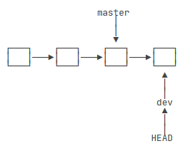
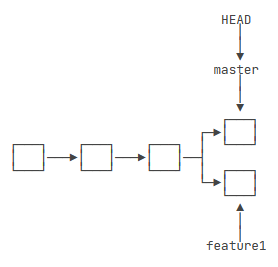

# git分支管理

参考[廖雪峰的git教程](https://www.liaoxuefeng.com/wiki/896043488029600)

## 工作区和暂存区

- 工作区就是本地仓库看到的目录内容
- 版本库(Repository)：工作区有一个隐藏目录`.git`,这个不属于工作区，这是版本库。
- 其中版本库里面存了很多东西，其中最重要的就是stage(暂存区)

## 管理修改

`git add`将文件添加到暂存区，`git commit`将**暂存区中**的修改添加到本地仓库。
用`git diff HEAD -- <filename>`命令可以查看工作区和版本库里面最新版本的区别。

## 撤销修改

- 可以通过`git checkout -- <filename1> <filename2>`退回最近一次`git add`或`git commit`时对应的状态，直接丢弃工作区的修改。
- 添加到暂存区而没有添加到本地仓库的修改可以通过`git reset HEAD <file>`撤销暂存区的修改(unstage)，`reset`命令既可以回退版本，也可以把暂存区的修改回退到工作区。当我们用HEAD时,表示最新的版本。再通过`git checkout -- <filename>`撤销工作区的修改。
- 当已经`commit`修改但还没有`push`到远程仓库，可以通过**版本回退**回退到上一个版本。要回退到指定版本，首先`git log`得到历史版本及版本号，再`git reset --hard HEAD^/commit_id`回退上一个版本，`HEAD~100`回退第前100个版本。如果当前命令行没有关闭，那可以往上翻翻再找找那个版本号，再通过版本号前几位找回这个被回退的状态；如果当前终端被关闭了，可以通过`git reflog`查看历史命令以找到版本号再*重返未来*。
- 注意：从来没有被添加到版本库就被删除的文件，是无法恢复的！

## 分支管理

git将分支修改的提交串成一个时间线。（HEAD是当前分支）这样直接`git merge <name>`将某分支合并到当前分支。

不同的分支同时新增了修改，就意味着有两个平行的时间线。两个分支同时修改了同一个文件，再合并分支就会出现冲突，git不知道采取哪种修改，无法实现快速合并，这时候就需要手动解决冲突。

解决冲突就是把Git合并失败的文件手动编辑为我们希望的内容，再提交。
例如

```txt
Git is a distributed version control system.
Git is free software distributed under the GPL.
Git has a mutable index called stage.
Git tracks changes of files.
<<<<<<< HEAD
Creating a new branch is quick & simple.
=======
Creating a new branch is quick AND simple.
>>>>>>> feature1
```

那我们就要手动将当前HEAD分支和feature1分支的不同部分修改为feature1的内容，再合并分支。

用`git log --graph`命令可以看到分支合并图。
